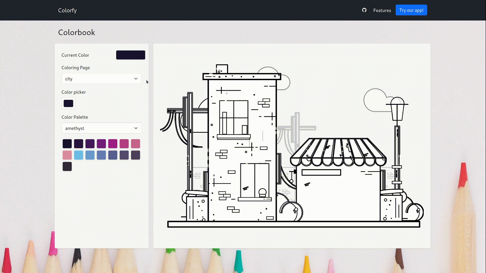

# Colorfy

## About Colorfy

Colorfy is a mobile friendly single page app that allows users to color images
using a color picker or a pre-set color palette.

Colorfy was created as a part of the a Hackthon hosted by [Mintbean](https://www.mintbean.io/)

## Technologies & Libraries
- React
- Bootstrap
- React Router
- JavaScript
- HTML
- CSS

**Deployed with GitHub Pages**

## Functionality
- Custom color picking
- Color picking from pre-set color palettes
- Drop down color pages selection

### Demo


## Installation
Clone this repo and then install the required packages using `npm` or `yarn`
```
npm install
```

Then run the app on a local server using:
```
npm run start
```

## Engineers
- [Amy Nguyen-Dang](https://www.linkedin.com/in/amy-nguyen-dang/)
- [Amber Terry](https://www.linkedin.com/in/amberterry/)
- [Roselle Bernardino](https://linkedin.com/in/rosellebernardino)

